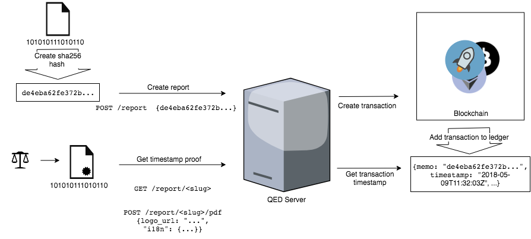

# QED API

The QED REST API provides an easy way to leverage blockchain technology attaching immutable timestamps to your files.



## IOS SDK

An IOS SDK providing a convenience wrapper over the QED REST API and other convenience types is available [here](ios_sdk/README.md)

## Usage

Each HTTP request has to be authenticated by an API key. In order to use the QED REST API, you must obtain an API Key. Please get in contact: mail@qed.digital.

The API key is submitted via the `Authorization` header as `app-token <API_KEY>`, i.e.
```
curl -X POST \
    https://api.qed.digital/...
    -H 'Authorization: app-token l1MttwRc4SJcuQwDabcDFF23noLjgEyUFmWZZZIgCVekwlOmBmGtDtaEvxJHBuM3'
```

### Storing a hash to the blockchain

An array of 32 bytes can be stored to the blockchain. In order to make the hash of your file collision-free we highly recommend to use SHA256 as the hashing algorithm to securely create a checksum for your file. The hash is expected to be encoded as a hex digest.

#### Endpoint

`https://api.qed.digital/v1/reports/`

#### Data

|Key|Type|Description|Example|
|---|-----------|-------|----|
| ``name`` | `string` | an arbitrary title | "My new appartement"
| `note` | `string` | an arbitrary note | "This is so amazing."
| `hash` | `string` | hex encoded string representing a byte array (maximum bytes 32) | "646412deadbeef8812"

#### cURL example
```
curl -X POST \
    https://api.qed.digital/v1/reports/ \
    -H 'Authorization: app-token l1MttwRc4SJcuQwDabcDFF23noLjgEyUFmWZZZIgCVekwlOmBmGtDtaEvxJHBuM3' \
    -H 'Content-Type: application/json' \
    -d '{
        "name": "My new appartement", // an arbitrary title as string,
        "note": "This is so amazing.", // an arbitrary note as string,
        "hash": "deadbeef" // hex encoded string representing a byte array (maximum bytes 32)
    }'
```

#### Output

Due to the asynchronous nature of the blockchain interaction, a report can have different states which are directly related to the transaction state on the blockchain. At which time a blockchain transaction is available and confirmed depends on both low level implementation details of the concrete chain and the high level SDKs wrapping blockchain interaction functionalities.

For a more detailed description of the transaction resource, please jump to the [transaction section](#transaction).

```
{
  "slug": "U1FKSif",
  "status": "pending", // "pending"|"confirmed"|"failed"
  "name": "My new appartement",
  "note": "This is so amazing",
  "hash": "deadbeef",
  "tx": {
     "hash": "af051c4d7a44a43459661b0943153d929f5370beacfeedc6cde6545fae981969" // deterministic hash of the transaction which can be used to access details of the transaction
     // More transaction details as soon as the transaction has been successfully processed by the blockchain network
  }
}
```


### Retrieving the report status

#### Endpoint

`https://api.qed.digital/v1/reports/<slug>`

#### cURL example

```
curl -X GET \
    https://api.qed.digital/v1/reports/U1FKSif \
    -H 'Authorization: app-token l1MttwRc4SJcuQwDabcDFF23noLjgEyUFmWZZZIgCVekwlOmBmGtDtaEvxJHBuM3' \
    -H 'Content-Type: application/json'
```

#### Output

```
{
  "slug": "U1FKSif",
  "status": "confirmed",
  "name": "My new appartement",
  "note": "This is so amazing",
  "hash": "deadbeef",
  "tx": {
     "hash": "af051c4d7a44a43459661b0943153d929f5370beacfeedc6cde6545fae981969"
     "data": {...}, // generic JSON object (Blockchain implementation specific)
     "block_height": 8872466,
     "block_time": "2018-05-09T11:32:03Z",
     "explorer_url": "https://testnet.steexp.com/tx/642b0791738b1d202cb2e6d3c7fd811310cf0d990baba1a2b418cc4123a970b6",
     "network_name": "Stellar Testnet",
     "network_id": "cee0302d59844d32bdca915c8203dd44b33fbb7edc19051ea37abedf28ecd472"
  }
}
```

### Transaction information<a name="transaction"></a>

| Key | Type | Description | Example |
| --- | ---- | ----------- | ------- |
| `hash` | `string` | Deterministic hash of the transaction which can be used to access details of the transaction. | "af051c4d..." |
|`data`|`JSON`|Blockchain-dependent data representation|*{"id": "fdcbb4e...", "paging_token": "38112560532193280", "hash": "fdcbb4e...", "ledger": 8873772, "created_at": "2018-05-09T13:20:53Z", "source_account": "GAS5AL...", "source_account_sequence": "36978014856151081", "fee_paid": 100, "operation_count": 1, ...}*|
|`block_height`|`integer`|Block number|8872466|
|`block_time`|`ISO 8601`|Validation time of the block which is represents the time the proof has been ultimately persisted|"2018-05-09T11:32:03Z"|
|`explorer_url`|`URL`|Points to a blockchain explorer transaction detail page |[https://testnet.steexp.com/tx/642b07917...8cc4123a970b6](https://testnet.steexp.com/tx/642b0791738b1d202cb2e6d3c7fd811310cf0d990baba1a2b418cc4123a970b6)|
|`network_name`|`string`|High level name of the concrete blockchain network| "Stellar Testnet" |
|`network_id`|`string` or `integer`|Internal identifier for the network which lies within the scope of the concrete blockchain family. It can take multiple forms depending on the blockchain.|"cee0302d59844d32b...a37abedf28ecd472"|


### PDF Generation

Generate a custom proof of existence certificate PDF.  

#### Endpoint

`https://api.qed.digital/v1/reports/<slug>/pdf`

#### cURL example

```
curl -X POST \
    https://api.qed.digital/v1/reports/<slug>/pdf/
    -H 'Authorization: app-token l1MttwRc4SJcuQwDabcDFF23noLjgEyUFmWZZZIgCVekwlOmBmGtDtaEvxJHBuM3' \
    -d '{
        "i18n": {...} // See below for full set of i18n options
        "address": "Immoweb s.a., Avenue Général Dumonceau, 56, B-1190 Forest, Belgium" // Address field
        "online_check": <URL TO SHA256 ONLINE VALIDATION TOOL> // defaults to https://emn178.github.io/online-tools/sha256_checksum.html
        "logo_url": "http://example.com/logo.png"  // Please make sure that the image is scaled appropriately
    }'
```

#### i18n Parameters

|Key|Description|Default|
|---|-------|----|
|`certificate`|Document title|"Certificate of Existence"|
|`description`|Brief description|"This certificate documents the existence of a file on the blockchain."|
|`details`|*translatable text*|"Details"|
|`encryption`|Encryption explanation text|"The checksum of the file was generated using the cryptographic hash function SHA256 (Secure Hash Algorithm 256)"|
|`check_tx`|*translatable text*|"Check the transaction"|
|`download_hint`|*translatable text*|"The file can be downloaded here"|
|`verify_hint`|*translatable text*|"To verify the file manually you can use this tool to generate a checksum and compare to the hash stored on the blockchain"|
|`no_file`|*translatable text*|"The file was stored outside of the scope of the service. The creator is responsible for providing the original data for evidence.|
|`i18n_blockchain_data`|*translatable text*|"Blockchain data"|
|`i18n_block_number`|*translatable text*|"Block no."|
|`i18n_block_date`|*translatable text*|"Block date"|
|`i18n_file_hash`|*translatable text*|"File hash"|
|`i18n_sender_account`|*translatable text*|"Sender account"|
|`i18n_network_id`|*translatable text*|"Network ID"|
|`i18n_network_name`|*translatable text*|"Network name"|
|`i18n_transaction_id`|*translatable text*|"Transaction ID"|
