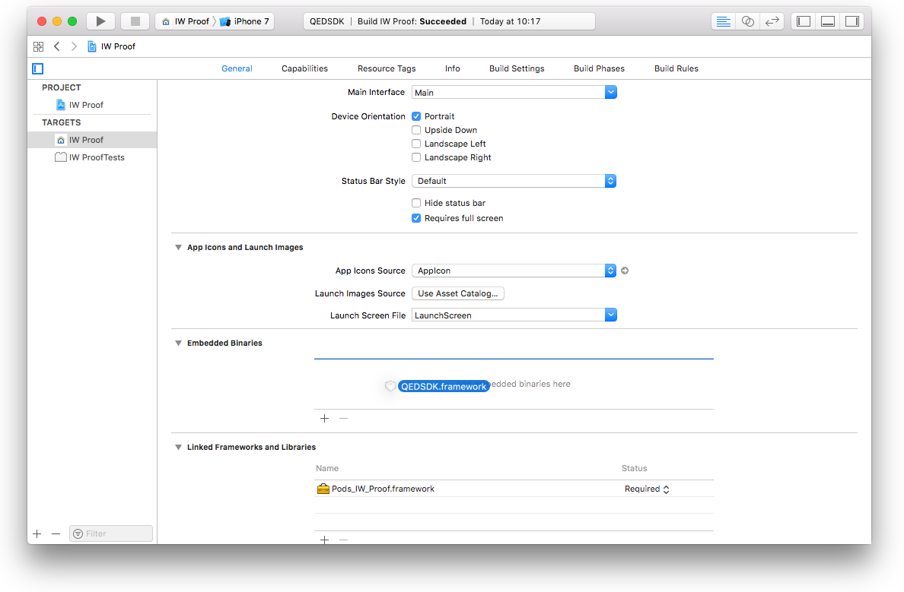
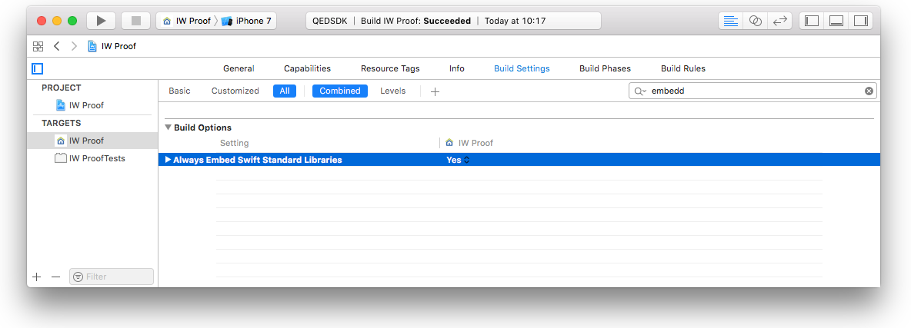

# QEDSDK Documentation for IOS

The IOS _QEDSDK_ provides a set of convenience instance types aimed to ease and shorten the development time for the usage of the [_QED REST API_](../README.md).

The main type is the [`QEDAPI`](#qedapi-class-reference) class, which is a wrapper over the functionality of the [_QED REST API_](../README.md).
The [`QEDFile`](#qedfile-type-reference) defines the representation of a data file to be reported to and notarized by the [_QED REST API_](../README.md). The [`QEDAPI`](#qedapi-class-reference) class receives and returns "file report" representations using the [`QEDFile`](#qedfile-type-reference) struct.

Two more convenience types are provided which are optional to use:
- The [`QEDModel`](#qedmodel-type-reference) provides a set of convenience methods to aid on persisting and retrieving a data model to/from local storage.
- The [`QEDVideoPlayRecordViewController`](#qedvideoplayrecordviewcontroller-class-reference) provides in a simple interface, the necessary functionality to play and record videos. You can use this view controller out of the box if your application is meant for video capturing for notarization.

# Contents

1. [Getting Started](#getting-started)
1. [Type Reference](#types)
    - [`QEDAPI`](#qedapi-class-reference)
    - [`QEDFile`](#qedfile-type-reference)
    - [`QEDModel`](#qedmodel-type-reference)
    - [`QEDVideoPlayRecordViewController`](#qedvideoplayrecordviewcontroller-class-reference)
1. [Protocols Reference](#protocols)
    - [`QEDVideoPlayRecordViewControllerDelegate`](#qedvideoplayrecordviewcontrollerdelegate-protocol-reference)

# Getting Started

## Add the SDK to your project

### Cocoa Pods
1. To integrate _QEDSDK_ for iOS into your Xcode project using CocoaPods, specify it in your `Podfile`:

    ```ruby
    source 'https://github.com/CocoaPods/Specs.git'
    platform :ios, '10.0'
    use_frameworks!

    target 'YOUR_APPLICATION_TARGET_NAME_HERE' do
        pod 'QEDSDK', '1.0.0'
    end
    ```
2. Then, run the following command:
    ```shell
    $ pod install
    ```

### Manually
1. Drag **QEDSDK.framework** to the **Embedded Binaries** section in the _General_ tap of your project's main target. Check _Copy items if needed_ and choose to _Create groups_.
    

1. Add a new Run Script Phase in your target’s Build Phases.

    **IMPORTANT**: Make sure this Run Script Phase is below the Embed Frameworks build phase. You can drag and drop build phases to rearrange them.

    Paste the following line in this Run Script Phase's script text field:
    ```shell
    bash "${BUILT_PRODUCTS_DIR}/${FRAMEWORKS_FOLDER_PATH}/QEDSDK.framework/ios-strip-frameworks.sh" QEDSDK
    ```

    

3. (Ignore if your project is a Swift only project) - Set the **Always Embed Swift Standard Libraries** setting in your targets _Build Settings_ to **YES**

    

## Get your API Key
In order to use the _QEDSDK_, you must obtain an API Key. Please get in contact: mail@qed.digital.

## Quick Launch
1. Open your _AppDelegate_ file and import the _QEDSDK_.
    ```swift
    import QEDSDK
    ```
1. Copy the lines below and paste them into your AppDelegate’s `application(_:didFinishLaunchingWithOptions:)` method
    ```swift
    QEDAPI.setup(with: "YOUR_API_KEY")
    ```
1. Prepare a [`QEDFile`](#qedfile-type-reference) representing a local data file to be reported and notarized

    - Create a [`QEDFile`](#qedfile-type-reference) instance. You can instantiate from the local URL for an existing file.
        ```swift
        var file = QEDFile(with: localFileURL)!
        ```
    - Calculate the _SHA256_ hash of the content file if not done yet.
        ```swift
        file = file.withCalculatedHash()
        ```
1. Use the [`QEDAPI`](#qedapi-class-reference) class methods to interact with the [_QED REST API_](../README.md) server

    - Issue a report to the backend for notarization
        ```swift
        QEDAPI.sendReport(for: file) { (updatedFile, error) in
            // Make sure to perform UI update related actions on main thread
            DispatchQueue.main.async {
                guard error == nil else {
                    // Handle reporting errors. The `error` instance will
                    // include detailed information.
                    return
                }
                // Handle success. Update your data source and UI accordingly.
                // `updatedFile` contains a copy of `file` with an updated `proofStatus`
            }
        }
        ```
    - You can check periodically for status updates until report is `confirmed`
        ```swift
        QEDAPI.getReport(for: file) { (updatedFile, error) in
            // Make sure to perform UI update related actions on main thread
            DispatchQueue.main.async {
                guard error == nil else {
                    // Handle reporting errors. The `error` instance will
                    // include detailed information.
                    return
                }
                // Handle success. Update your data source and UI accordingly.
                // `updatedFile` contains a copy of `file` with an updated
                // `proofStatus`
            }
        }
        ```
    - Once the [`QEDFile`](#qedfile-type-reference) status is `confirmed`, you can request a PDF certificate from backend
        ```swift
        QEDAPI.generatePDF(for: file) { (success, error) in
            // Make sure to perform UI update related actions on main thread
            DispatchQueue.main.async {
                guard success, error == nil else {
                    // Handle pdf generation errors. The `error` instance will
                    // include detailed information.
                    return
                }
                // Handle success. Update your data source and UI accordingly.
                // The PDF proof document is now stored in the `pdfURL` of
                // the requested `file`
            }
        }
        ```

# Types

## `QEDAPI` Class Reference

`Class`

The `QEDAPI` provides a wrapper class on the [_QED REST API_](../README.md).

### Setup

```swift
class func setup(with apiKey : String)
```
Will setup the `QEDAPI` shared instance with the required `apiKey` to make authenticated requests.

| Parameter | Description |
| --------- | ----------- |
| `apiKey`  | The key to make authenticated requests to the [_QED REST API_](../README.md) |

**Discussion**

If you use the methods on this class without calling this setup method first, the requests will sill be made but will fail on the server due to Authentication restrictions.

### Issuing API Requests

 ```swift
 class func sendReport(for file : QEDFile, completion : (QEDFile?, Error?)->Void)
 ```

 Will issue a request to the backend (for initial submission or updates if previously reported) for a notarizing report of the given `file`.

 | Parameter  | Description |
 | ---------  | ----------- |
 | `file`     | The [`QEDFile`](#qedfile-type-reference) representing the file content to be notarized|
 |`completion`| The completion handler to call when the request is complete. This handler is not called on the main thread |

 The `completion` handler takes the following parameters:

 | Parameter        | Description |
 | ---------        | ----------- |
 | `updatedFile`    | `nil` if request failed, otherwise a [`QEDFile`](#qedfile-type-reference) instance created as a copy of `file` with an updated `proofStatus` based on API response data|
 | `error`          | An error object that indicates why the request failed, or `nil` if the request was successful|

 **Discussion**

 After posting a report for a `file` for the first time, a blockchain proof is initiated.

 The server will respond with the updated report including blockchain transaction details. In most cases the report status will be `pending` when posting for the first time.

  ___
  ```swift
  class func getReport(for file : QEDFile, completion : (QEDFile?, Error?)->Void)
  ```

  Will get the current report data for a given `file` from the backend.

  | Parameter | Description |
  | --------- | ----------- |
  | `file`    | The [`QEDFile`](#qedfile-type-reference) representing the file content report to be updated from backend|
  |`completion`| The completion handler to call when the request is complete. This handler is not called on the main thread |

   The `completion` handler takes the following parameters:

   | Parameter        | Description |
   | ---------        | ----------- |
   | `updatedFile`    | `nil` if request failed, otherwise a [`QEDFile`](#qedfile-type-reference) instance created as a copy of `file` updated based on API response data|
   | `error`          | An error object that indicates why the request failed, or `nil` if the request was successful|
  **Discussion**

  After initial submission of a report, you use this method to update the [`QEDFile`](#qedfile-type-reference) `file` properties from backend. Specially the `proofStatus`

### Constants representing API attributes


## `QEDFile` Type Reference
`Struct`

A `QEDFile` represents a data file locally stored on the user device that needs to be time stamped and notarized on the blockchain

### Initializers

```swift
init?(with fileURL : URL)
```
Creates a `QEDFile` instance for the given local `fileURL`.

| Parameter | Description |
| --------- | ----------- |
| `fileURL` | The local URL for the file to reference in the `QEDFile` instance. |

**Discussion**

The `name`, `ext` and `dateTaken` will be captured from the file at `fileURL`. If the content file at `fileURL` does not exist, the initialization fails and returns `nil`

___
```swift
init(withName name : String, extension ext : String, dateTaken: Date)
```
Creates a `QEDFile` instance with a given `name`, extension(`ext`) and `dateTaken`.

| Parameter   | Description |
| ---------   | ----------- |
| `name`      | A string representing the name of the local file without extension |
| `ext`       | A string representing the extension of the local file |
| `dateTaken` | A `Date` instance representing the date the file was created |

**Discussion**

The `fileURL` will be infered from the default file storage `qedDirectory`, the `name` and the extension(`ext`)

The `dateTaken` is just used as metadata and will be different that the timestamp on the blockchain certificate.

___
```swift
init?(fromQEDAPIResponseDict dict : [String:Any], fileURL : URL? = nil)
```
Creates a `QEDFile` instance from a Dictionary from API response.

| Parameter   | Description |
| ---------   | ----------- |
| `dict`      | A dictionary representation of a `QEDAPI` qualified response with report data |
| `fileURL`   | An optional URL indicating the local storage location of the associated file.|

**Discussion**

For a list of valid `QEDAPI` report response attribues see [here](#constants-representing-api-attributes).

`dict` must include `name`, `slug`, `hash`, `dateTaken` string and `status` as a minimum otherwise the instantiation will fail and return `nil`.

If `fileURL` is `nil`, the instance `fileURL` attribute will be infered from the default file storage `qedDirectory` and the calculated instance `name` and extension(`ext`).

If you manage local file storage on a separate location, you should pass the `fileURL` indicating the local URL for the `QEDFile` content file if existing. You can also update the `fileURL` attribute at a later time.

### Static properties

```swift
static var qedDirectory : URL
```
Default storage directory for the `QEDFile` content file in the app's bundle.

**Discussion**

You can use this directory to store the files you want to represent as `QEDFile`'s for notarization.
If you use this default directory, then you can create `QEDFile` instances directly with `name`, `ext` and `dateCreated` values for the file, and the local `fileURL` location will be assumed to be on the root level of this directory.

 ___

 ```swift
 static var pdfDirectory : URL
 ```
 Storage dictionary for the downloaded PDF files in the app bundle.

 **Discussion**

 When downloading PDF certificates for a `QEDFile` using the [`QEDAPI` class](#qedapi-class-reference), they will be automatically stored on the root level of this local directory.
 You can get the exact PDF url by accessing the `pdfURL` property of the `QEDFile`.

### Instance Properties
```swift
var name : String
```
The name for the associated file without extension
 ___

```swift
var ext : String
```
A string representing the type of file (i.e the extension).
___

```swift
var ext : String
```
A string representing the type of file (i.e the extension).
___

```swift
var dateTaken : Date
```
The client date when the file was created.

**Discussion**

Used only as metadata.

Will differ from the timestamp on the blockchain certificate.
___

```swift
var note : String?
```
An optional string with a note about the file.

**Discussion**

Used only as metadata.
___

```swift
var slug : String?
```
A unique string that identifies the reported file in the backend.

**Discussion**

When initially created, this value is `nil` and gets updated by the relevant [`QEDAPI`](#qedapi-class-reference) report methods once a report is submitted to the backend.
___

```swift
var hash : String?
```
The hash to be stored on the blockchain as proof of existence of the associated file.

**Discussion**

This value must not be `nil` when issuing a report with the [`QEDAPI`](#qedapi-class-reference).

It is recomended to use _SHA256_ to calculate the hash, and the convenience method `withCalculatedHash()` will take care of this for you.
___

```swift
var proofStatus : ProofStatus
```
The current status of the notarization on the blockchain as reported by the backend.

**Discussion**

`ProofStatus` enum possible values are:
- `undefined`: The file has not been requested for certification yet
- `pending`: The report has been submitted to blockchain but is not yet confirmed
- `confirmed`: Report confirmed in blockchain
- `failed`: Report was submitted to blockchain but failed
___

```swift
var fileURL : URL
```
The URL where the file is meant to be locally stored.

**Discussion**

There is no guarantee that a file actually exists at this URL. See `localFileLocation`.
___

```swift
var localFileLocation : URL?
```
The actual location url for the local file.

**Discussion**

Will return `nil` if the file addressed by the `fileURL` does not exist.
___

```swift
var pdfURL : URL
```
The URL for the PDF certificate file when locally stored.

**Discussion**

This property always holds a URL value without checking if the file actually exist.
Use `hasLocalPDF` to check for PDF file existence
___

```swift
var hasLocalFile : Bool
```
Indicates if the instance references and existing local file at `fileURL`
___

```swift
var isSynchedWithServer : Bool
```
Indicates if the file has already been reported to the server. (i.e. if it has a `slug`)
___

```swift
var hasLocalPDF : Bool
```
Indicates if the instance references and existing local certificate file at `pdfURL`

### Instance Methods

```swift
func withCalculatedHash() -> QEDFile
```
Returns a `QEDFile` instance with the `hash` calculated from the file at `localFileLocation`.

**Return Value**

Returns a copy of the current instance where the _SHA256_ `hash` has been calculated from the data in file at `localFileLocation`.

If there is no local file (i.e. `localFileLocation == nil`) then the same unaffected instance is returned (i.e. `self`)

___

```swift
func merge(withFile file : QEDFile) -> QEDFile
```
Returns a new `QEDFile` instance by merging the current instance with `file`.

**Return Value**

Returns a new ``QEDFile`` instance.
All the properties of the `file` instance that are non `nil` will prevale over the values for the properties of the current instance, the `proofStatus` is also merged

___

```swift
func dictionaryRepresentation() -> [String:String]
```
Returns a dictionary representation of the instance

**Return Value**

Returns a dictionary compatible with the [`QEDAPI`](#qedapi-class-reference) reporting functionality.

The keys are `String` instances as described [here](#constants-representing-api-attributes), the values are `String` instances derived from the instance properties.

## `QEDModel` Type Reference
`Struct`

`QEDModel` provides a set of helper methods to aid on persisting a data model ( represneted as an array of [`QEDFile`](#qedfile-type-reference) instances).

Usage of `QEDModel` is optional and is meant just as an aid to speed up your data source implementation.

### Static methods

```swift
static func persist(filesArray files : [QEDFile])
```
Will persist a given array of [`QEDFile`](#qedfile-type-reference) instances to _User Defaults_.

| Parameter | Description |
| --------- | ----------- |
| `files`   | An array of [`QEDFile`](#qedfile-type-reference) instances representing your data model to be persisted locally to _User Defaults_ |

**Discussion**

Normally you will call this method when the app goes to background, passing your in memory model array for persisting.
___

```swift
static func loadFromStore() -> [QEDFile]
```
Returns the locally persisted array of [`QEDFile`](#qedfile-type-reference) instances.

**Return Value**

Returns the currently persisted array of [`QEDFile`](#qedfile-type-reference) instances from _User Defaults_

If no array is persisted currently in  _User Defaults_, an empty array will be returned.

## `QEDVideoPlayRecordViewController` Class Reference
`class`

A _ViewController_ providing record and playback video functionality for locally stored video files.

It will switch automatically between video playback and video recording modes depending on the internal value for the local stored video file.

If a local video file is assigned, the controller will be in playback mode, otherwise in recording mode.

If allowed by the `delegate`, a user can trigger the deletion of the local stored video file. After deletion the controller will switch to recording mode automatically.

### Initializers

```swift
init(delegate : QEDVideoPlayRecordViewControllerDelegate, directory : URL, fileURL : URL? = nil, autoplay : Bool = false)
```
Initialize a `QEDVideoPlayRecordViewController` for presentation

| Parameter  | Description |
| ---------  | ----------- |
| `delegate` | A `class` instance conforming to the [`QEDVideoPlayRecordViewControllerDelegate`](#qedvideoplayrecordviewcontrollerdelegate-protocol-reference) protocol. The delegate is not retained |
| `directory` | A local file directory where to store the newly recorded video files |
| `fileURL`   | An optional URL for a local video file. Defaults to `nil`|
| `autoplay`  | An indication if the video should autoplay when initialized with an existing local video URL. Defaults to `false`|

**Discussion**

The instance provide both recording and playback of video content. It will switch automatically between video playback and video recording modes depending on the internal value of `fileURL`.

When initialized with a valid `fileURL`, the controller will start on playback mode when presented and will play automatically if `autoplay == true`.

If `fileURL == nil` on initialization, the controller will start on recording mode when presented.


# Protocols

## `QEDVideoPlayRecordViewControllerDelegate` Protocol Reference

A class conforming to this protocol will receive the necessary method calls to handle the lifecycle for the video playback, recording and deletion from a [`QEDVideoPlayRecordViewController`](#qedvideoplayrecordviewcontroller-class-reference).

### File Deletion

```swift
func videoPlayRecordController(_ controller: QEDVideoPlayRecordViewController, allowToDeleteFileAt fileURL : URL) -> Bool
```
Asks the delegate if a local video file can be deleted.

| Parameter    | Description |
| ---------    | ----------- |
| `controller` | The controller object informing the delegate of this event |
| `fileURL`    | The local URL for the file the request is made for |

**Return Value**

`true` if the file at `fileURL` could be deleted by the user, otherwise `false`.

**Discussion**

Returning `true` does not trigger file deletion, but a delete button will be made available to the user. File deletion can then be triggered by the user by tapping on the delete button.
___

```swift
func videoPlayRecordController(_ controller: QEDVideoPlayRecordViewController, fileDeletionRequestedFor fileURL : URL)
```
Tells the delegate a file deletion has been requested for a local file.

| Parameter    | Description |
| ---------    | ----------- |
| `controller` | The controller object informing the delegate of this event |
| `fileURL`    | The local URL for the file that has been requested for deletion |

**Discussion**

It is up to your implementation to actually delete the file from the file system.

After calling this method the controller will clear its reference to the reported `fileURL`

### Video Recording

```swift
func videoPlayRecordController(_ controller: QEDVideoPlayRecordViewController, userRecordedFileAt fileURL : URL)
```
Tells the delegate the user has finished recording a new video.

| Parameter    | Description |
| ---------    | ----------- |
| `controller` | The controller object informing the delegate of this event |
| `fileURL`    | The local URL for the new video file recorded by the user |

**Discussion**

When this method is called, the user has ended recording a video file which is now available at `fileURL`. You must not delete this file as the controller has now switched to playback mode and expects the existence of the video file at `fileURL`

You can choose to act on this request and trigger your logic for new videos, but be aware that the user can still trigger file deletion for the new video. It is recomended instead to handle new video logic once the user has requested to dismiss the controller. For more info on this, see `videoPlayRecordController(_:dismissalRequestWithNewRecordedFileAt:keepingFile)`
